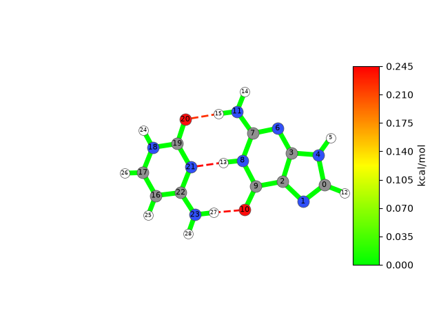

.. _custom-bonds:

=================
Customizing Bonds
=================

By default, JEDI constructs its redundant internal coordinates from the molecular connectivity.
For some applications it may be relevant to include additional interactions that are not represented by ordinary covalent bonds.

This tutorial demonstrates how to add custom bonds to the analysis.
The mechanism may serve useful to add hydrogen bonds for consideration, or (intramolecular) long-distance interactions.

Adding Hydrogen Bonds
=====================

Adding hydrogen bonds for consideration is fairly straightforward, as JEDI provides the :func:`~strainjedi.utils.get_hbonds` helper function.
Do note, however, that if you only wish to include certain hydrogen bonds, you will have to specify them yourself, see :ref:`anything-else`.

Let us use one of the examples from the previous page, specifically the one pertaining to the Gaussian calculator.
Here, we have two molecules: Cytosine and Guanine, interacting via three hydrogen bonds.
We will modify the code thusly:

.. code-block:: python
   :emphasize-lines: 4,11

   from strainjedi.io import read_output
   from strainjedi.io.adapter import to_atoms, to_vibrations
   from strainjedi.jedi import Jedi
   from strainjedi.utils import get_hbonds # add this line

   mol = to_atoms(read_output("output/opt.log"))
   mol2 = to_atoms(read_output("output/dist.log"))
   hessian = to_vibrations(read_output("output/freq.log"), mol)

   jedi = Jedi(mol, mol2, hessian)
   jedi.add_custom_bonds(get_hbonds(mol)) # and this line
   jedi.run()
   jedi.visualize(show=True, show_indices=True, single_mode="all")

We successfully added hydrogen bonds for consideration. They are visualized with dotted lines. You will also notice that the atoms in the visualization now carry their atom indices (by means of ``show_indices=True``).
This will serve useful in the second part of this tutorial, where we add custom interactions between molecules.

.. caution::
   In JEDI, as in ASE, atom indices are zero-based, following Python's indexing convention.
   When comparing results with other tools that use atom indices starting at 1, keep this difference in mind.

.. _anything-else:

Adding Other Bonds
==================

To add hydrogen bonds, we used the ``get_hbonds()`` helper function in combination with :func:`~strainjedi.Jedi.add_custom_bonds`.
Of course, we can also add any other custom bond using the ``add_custom_bonds()`` function alone.
For that, we have to define a `NumPy array <https://numpy.org/doc/stable/reference/arrays.ndarray.html>`_ using the atom indices for our chosen custom bond(s).

.. code-block:: python
   :emphasize-lines: 3,10,11,12

   from strainjedi.io import read_output
   from strainjedi.io.adapter import to_atoms
   from strainjedi.jedi import Jedi
   import numpy as np # add this line

   mol = to_atoms(read_output("output/opt.log"))
   mol2 = to_atoms(read_output("output/dist.log"))
   hessian = to_vibrations(read_output("output/freq.log"), mol)

   jedi = Jedi(mol, mol2, hessian)
   c_bond = np.array([15, 20]) # for one custom bond
   c_bonds = np.array([[15, 20], [13, 21]]) # just add a square bracket separated by a comma for more custom bonds
   jedi.add_custom_bonds(c_bonds) # you can test c_bond and c_bonds
   jedi.run()
   jedi.visualize(show=True, show_indices=True, single_mode="all")

Conclusion
==========

This concludes this tutorial on adding custom interactions like hydrogen bonds.
At this stage we want to reiterate that JEDI itself does not perform geometry optimizations.
This mechanism serves to add long-range interactions that aren't accounted for by the redundant internal coordinates.

Put briefly, if the distance between two atoms is more than the sum of their covalent radii, JEDI considers them not bonded.
These are the atoms you may have to connect via a custom bond.
