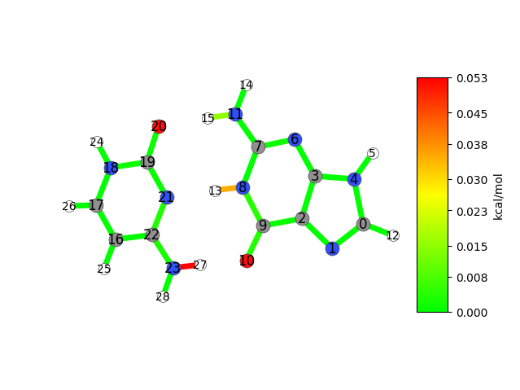

=================
Customising Bonds
=================

By default, JEDI constructs its redundant internal coordinates from the molecular connectivity.
For some applications it may be relevant to include additional interactions that are not represented by ordinary covalent bonds.

This tutorial demonstrates how to add custom bonds to the analysis.
The mechanism may serve useful to add hydrogen bonds for consideration, or (intramolecular) long-distance interactions.

Adding Hydrogen Bonds
=====================

Adding hydrogen bonds for consideration is fairly straightforward, as JEDI provides the :func:`~strainjedi.utils.get_hbonds` helper function.
Do note, however, that if you only wish to include certain hydrogen bonds, you will have to specify them yourself, see :ref:`anything-else`.

Let us use one of the examples from the previous page, specifically the one pertaining to the Gaussian calculator.
Here, we have two molecules: Cytosine and Guanine, interacting via three hydrogen bonds.
We will modify the code thusly:

.. code-block:: python
   :emphasize-lines: 3,10

   from strainjedi.io.gaussian import get_vibrations, read_gaussian_out
   from strainjedi.jedi import Jedi
   from strainjedi.utils import get_hbonds # add this line

   mol = read_gaussian_out("output/opt")
   mol2 = read_gaussian_out("output/dist")
   hessian = get_vibrations("output/freq", mol)

   jedi = Jedi(mol, mol2, hessian)
   jedi.add_custom_bonds(get_hbonds(mol)) # and this line
   jedi.run()
   jedi.visualize(show=True, show_indices=True)

We successfully added hydrogen bonds for consideration. You will also notice that the atoms in the visualisation now carry a number on them (by means of ``show_indices=True``).
This will serve useful in the second part of this tutorial, where we add custom interactions between molecules.

.. _anything-else:

Adding Other Bonds
==================

To add hydrogen bonds, we used the ``get_hbonds()`` helper function in combination with :func:`~strainjedi.Jedi.add_custom_bonds`.
Of course, we can also add any other custom bond using the ``add_custom_bonds()`` function alone.
First, we will investigate the structure ``get_hbonds()`` returns (and thus ``add_custom_bonds()`` expects): it is a list of lists, containing pairs of atom indices you wish to connect.

>>> from strainjedi.io.gaussian import read_gaussian_out
>>> from strainjedi.utils import get_hbonds
>>> mol = read_gaussian_out("output/opt")
>>> hbonds = get_hbonds(mol)
>>> print(hbonds)
[[13 21]
 [15 20]
 [10 27]]

From here on out, it should become clear how to add custom interactions for any pair of atoms in your structure.
First, you need to find the indices of the atoms you want to connect as JEDI sees them; using the visualisation with ``show_indices=True`` can help here.
Then, after you created the Jedi object, but before you start the analysis, you make a call to ``jedi.add_custom_bonds()`` as illustrated above.
Finally, you can start the analysis with your additional bonds set.

.. hint::

   Strictly speaking, ``add_custom_bonds()`` expects a numpy array.
   To satisfy your type-checker, you can call ``np.asarray()`` with your nested list of atom indices.

Conclusion
==========

This concludes this tutorial on adding custom interactions like hydrogen bonds.
At this stage we want to reiterate that JEDI itself does not perform geometry optimisations.
This mechanism serves to add connectivity which cannot be determined from the geometry (e.g. as an ``xyz`` file) alone.

Put briefly, if the distance between two atoms is more than the sum of their covalent radii, JEDI considers them not bonded.
These are the atoms you may have to connect via a custom bond, potentially in your calculator of choice as well.

