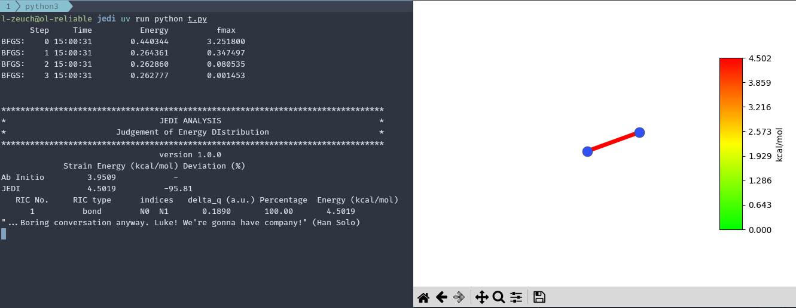

=========================
Introductory: Nitrogen
=========================

In this introductory tutorial, we will explore how to

#. create a molecular structure,
#. perform a geometry optimization,
#. obtain the Hessian

in the ASE framework, and finally how to start a JEDI analysis and interpret its results.

We will use nitrogen as a minimal system with only two atoms and one bond, as it contains all essential ingredients for a strain analysis.
EMT is used for convenience because it is fast, readily available in ASE, and sufficient to illustrate the workflow, even though it is not necessarily quantitative.

Complete Example
================

Here, you find the whole code example to test.
Below, every step is discussed in detail.

.. code-block:: python

   from ase import Atoms
   from ase.calculators.emt import EMT
   from ase.optimize import BFGS
   from ase.vibrations import Vibrations
   from strainjedi.jedi import Jedi

   # Create a structure
   atoms = Atoms('N2', [(0, 0, 0), (0, 0, 1.1)])

   # Set up calculator
   atoms.calc = EMT()

   # Optimize geometry
   BFGS(atoms).run(fmax=0.01)

   # Calculate vibrational modes (Hessian)
   vib = Vibrations(atoms)
   vib.run()
   modes = vib.get_vibrations()

   # Create a distorted structure based on the optimised geometry
   atoms_distorted = atoms.copy()
   atoms_distorted.positions[1][2] += 0.1

   atoms_distorted.calc = EMT()
   atoms_distorted.get_potential_energy()

   # Run JEDI analysis
   jedi = Jedi(atoms, atoms_distorted, modes)
   jedi.run()

   # Open visualisation window
   jedi.visualize(show=True, single_mode='bl')

Creating the Structure
======================

First, we will need a structure to analyse: as discussed, we choose a nitrogen molecule for that.
The ``Atoms`` object from ASE aids us in defining the structure: Two nitrogen atoms, and a reasonable starting distance between the atoms for the later conducted optimization.

.. code-block:: python

   from ase import Atoms

   atoms = Atoms('N2', [(0, 0, 0), (0, 0, 1.1)])  # 1.1 Angstrom

Selecting a Calculator
======================

JEDI itself does not perform geometry optimizations and instead relies on established calculators to do the "hard work" up front.
Here, we attach an EMT calculator to the structure.

.. code-block:: python

   from ase.calculators.emt import EMT

   atoms.calc = EMT()

Optimizing the Geometry
=======================
Just attaching a calculator doesn't do much by itself for our purposes, but it enables us to ask for an optimization.
In this case, we use the `BFGS algorithm <https://wikipedia.org/wiki/Broyden-Fletcher-Goldfarb-Shanno_algorithm>`_ as implemented by ASE.
Further, by setting :code:`fmax=0.01`, we ask ASE to optimize the structure quite well by restricting the maximum allowable force on all individual atoms.

.. code-block:: python

   from ase.optimize import BFGS

   BFGS(atoms).run(fmax=0.01)

Calculating the Hessian
=======================

Now that we performed a geometry optimization by means of BFGS, we can obtain the Hessian of the relaxed structure as a ``VibrationsData`` object.

.. code-block:: python

   from ase.vibrations import Vibrations

   vib = Vibrations(atoms)
   vib.run()
   modes = vib.get_vibrations()

Creating a Strained Structure
=============================

JEDI operates on a pair of geometries: a relaxed reference structure and a strained configuration.
The strained structure can originate from MD snapshots, constrained optimizations, or experimental geometries.
Here, we simply introduce a small Cartesian displacement to generate a test strain field.

.. code-block:: python

   atoms_distorted = atoms.copy()
   atoms_distorted.positions[1][2] += 0.1

Evaluating the Strained Structure Energy
========================================

The energy of the strained structure is required for the comparison between the harmonic strain estimate and the corresponding electronic energy difference.
This value is used internally when assessing the quality of the harmonic approximation.

.. code-block:: python

   atoms_distorted.set_calculator(EMT())
   atoms_distorted.get_potential_energy()

Running the JEDI Analysis
=========================

JEDI takes three inputs:

- equilibrium geometry and energy as an ``Atoms`` object,
- strained geometry and energy as an ``Atoms`` object,
- Hessian of the equilibrium geometry as a ``VibrationsData`` object.

From these, it performs the coordinate transformation of the Hessian, evaluates the strain distribution in internal coordinates, and computes the harmonic strain energy.

.. code-block:: python

   from strainjedi.jedi import Jedi

   jedi = Jedi(atoms, atoms_distorted, modes)
   jedi.run()

Results
=======

Running the discussed code should yield a printout to your console similar to the one below.

.. code-block:: text

         Step     Time          Energy          fmax
   BFGS:    0 11:31:04        0.440344        3.251800
   BFGS:    1 11:31:04        0.264361        0.347497
   BFGS:    2 11:31:04        0.262860        0.080535
   BFGS:    3 11:31:04        0.262777        0.001453

   ************************************************************************************************************************
   *                                                    JEDI ANALYSIS                                                     *
   *                                           Judgement of Energy DIstribution                                           *
   ************************************************************************************************************************
                                                        version 1.1.0
                       Strain Energy (kcal/mol)     Deviation (%)
   Ab Initio                    3.9509                    -
   JEDI                         4.5019                  13.95
         RIC No.             RIC type            indices          delta_q (a.u.)        Percentage      Energy (kcal/mol)
            1                  bond               N0  N1              0.1890              100.00              4.5019

For this system, strain is confined to the N–N stretching coordinate due to the absence of additional internal degrees of freedom.
Key outputs are the strain energy and its decomposition in internal coordinates, along with the comparison between harmonic and ab initio energy differences (from electronic structure calculations).
This deviation is a measure for the applicability of the harmonic approximation to the deformation experiment.

Visualisation
=============

While terminal/text output is useful for storing and later analysis, it is decidedly hard to interpret; for that reason, we provide a simple way to visualize the results via Matplotlib.
Add the following line to the end of the above code and re-run the script.

.. code-block:: python

   jedi.visualise(show=True, single_mode='bl')

This will launch a Matplotlib window visualizing the strain distribution in the molecule after the analysis is finished.
Setting ``single_mode`` to ``'bl'`` ensures that only the energy distribution across bonds is considered, since the molecule contains no angles or dihedral angles.

 a diatomic molecule with the bond highlighted in red and a kcal/mol color bar indicating strain energy distribution.
