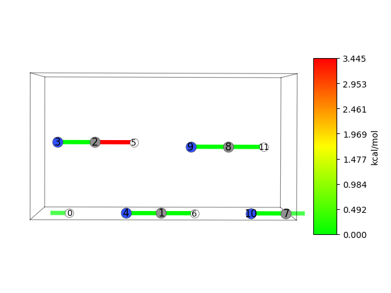

============================
Periodic Boundary Conditions
============================

As long as the unit cell's shape is constant through the analysis, you may also use periodic boundary conditions (PBC).
In this small tutorial we will emphasise the changes necessary to JEDI's callsites (i.e. the methods and functions you use), as well as how to add additional dipole interactions.

To follow along, we have provided some sample data in the :ref:`archive below <pbc_download>`.
How to start a calculation will not be discussed here --- we will only focus on how to use JEDI for PBCs.

Basic Analysis
==============

For these examples, we picked a crystal of HCN --- it exhibits strong intermolecular interactions with small molecules.
In essence, using JEDI for PBC is not much different from a standard JEDI analysis.
What's new here are the ``box=True`` and ``split_bonds=True`` paramaters; they will aid us in clearly identifying the unit cell.

.. code-block:: python

   import ase.io
   from ase.io.jsonio import read_json

   from strainjedi import Jedi
   from strainjedi.utils import get_hbonds

   mol = ase.io.read("opt.json")
   mol2 = ase.io.read("sp.json")
   vibdata = read_json("full_hessian.json")

   jedi = Jedi(mol, mol2, vibdata)
   jedi.run()
   jedi.visualize(show=True, box=True, split_bonds=True, show_indices=True)

However, with this approach there is one caveat: we're not including the dipole interactions.
We can fix that quite easily by using an already familiar function, :func:`~strainjedi.utils.get_hbonds`, but in a different setting.
Of course, you need not do this if you are not interested in such dipole interactions inside your PBC scenario.

Add this line after you created the ``jedi`` object, but before you call ``jedi.run()``:

.. code-block:: python

   jedi.add_custom_bonds(get_hbonds(mol, extra_hpartners=("C")))

This tells JEDI to consider carbon atoms as possible donors, as well as the "classic" hydrogen bond partners.
Finally, we see in our visualisation window the following unit cell (atom indices turned on for visibility):

Of course, partial analyses are also possible.
However, at this stage, we want to leave that as an exercise to the reader --- in case you wish for a refresher, refer to :ref:`Customising Bonds <custom-bonds>`.

.. _pbc_download:

Downloads
=========

:download:`pbc sample data <../_static/downloads/pbc.zip>`
