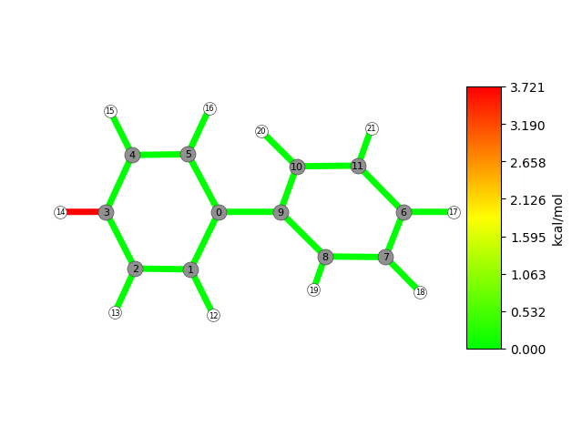
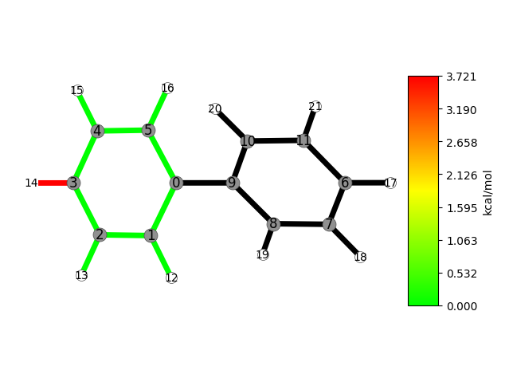

=======================
Analysing Substructures
=======================

When analysing large structures, but you're really only interested in small parts of the whole thing, it might be more useful to instead resort to a partial analysis.
On the previous page, we introduced the concept of *atom indices* --- this will receive another use here.

We will use the biphenyl molecule to illustrate a partial analysis.
To start, there are two approaches to be considered:

#. You performed a frequency analysis on the entire structure, or
#. you did so only on parts of the molecule

The first approach might be easier to reason about, so we will start with that one.
To follow along, see :ref:`download`.
Of note: because ASE does not have a reader that converts VASP ``freq.xml`` to a :external+ase:class:`~ase.vibrations.VibrationsData` object, we have provided the Hessian as a textual representation as well.
Hence, to ensure you have working code in order to follow along, we will load the Hessian using said textual representation.

Full Hessian
============

Assuming you performed a frequency analysis on the entire structure, but are only interested in parts thereof, you should pick this approach.

.. code-block:: python

   import numpy as np
   from ase.io.vasp import read_vasp_xml
   from ase.vibrations import VibrationsData

   from strainjedi import Jedi

   mol = next(read_vasp_xml("output/opt.xml"))
   mol2 = next(read_vasp_xml("output/dist.xml"))

   hessian = VibrationsData.from_2d(mol, np.loadtxt("output/hessian"))

   jedi = Jedi(mol, mol2, hessian)
   jedi.run()
   jedi.visualize(show=True, show_indices=True)

Running this script opens our trusted visualisation window as shown below.

Most of the code should already be familiar to you --- what might be unfamiliar is the ``next()`` call around :external+ase:func:`~ase.io.vasp.read_vasp_xml`, and ``np.loadtxt()``.

We want to use this opportunity to give some insight as to why that is: for starters, the ``read_vasp_xml()`` function returns a Python *Iterator*, which is not an accepted type in either JEDI or ``VibrationsData``.
Therefore, to actually receive something meaningful out of that iterator, we call ``next()`` on it, which will return the next item.

Secondly, as mentioned in the intro for this tutorial, ASE has no reader that can convert a VASP frequency analysis to a VibrationsData object (or we did not find it, contributions welcome!).
So, we provided the Hessian as a text representation, because NumPy provides a mechanism to load that back in via ``np.loadtxt()`` as something ASE can work with.
There is a takeaway to be had here, which we will leave as an exercise to the inclined reader.

With that tangent out of the way, you will notice one glaring issue: JEDI still analysed the entire structure!
Let's fix that by providing the indices we are actually interested in, which is the benzene ring with the strained C-H bond.
From the image, it's clear that the atoms with the indices 6 to 11, and 17 to 21 do not (significantly) contribute to the strain, so we will ignore those.

Therefore will modify the ``run()`` call as following, keeping in mind to provide the indices we are *interested in* (as opposed to the ones we do not care about).

.. code-block:: python

   jedi.run(indices=[0, 1, 2, 3, 4, 5, 12, 13, 14, 15, 16])

And execute the script again.

Partial Hessian
===============

JEDI also supports the result of a partial frequency analysis, though such an analysis may not be started by calling ``run()`` on your Jedi object.
Instead, we must explicitly call ``partial_analysis()``, with indices similar to how we performed an analysis with the full Hessian.
Enter the ``partial_hessian`` directory of the :ref:`archive provided below <substr_download>` and review the script provided there:

.. code-block:: python

   import numpy as np
   from ase.constraints import FixAtoms
   from ase.io.vasp import read_vasp_xml
   from ase.vibrations import VibrationsData

   from strainjedi import Jedi

   ignored_atoms = FixAtoms(indices=[6, 7, 8, 9, 10, 11, 17, 18, 19, 20, 21])

   mol = next(read_vasp_xml("output/opt.xml"))
   mol.set_constraint(ignored_atoms)

   mol2 = next(read_vasp_xml("output/dist.xml"))
   mol.set_constraint(ignored_atoms)

   interesting_atoms = [0, 1, 2, 3, 4, 5, 12, 13, 14, 15, 16]

   hessian = VibrationsData.from_2d(mol, np.loadtxt("output/partial_hessian"), indices=interesting_atoms)

   jedi = Jedi(mol, mol2, hessian)
   jedi.partial_analysis(indices=interesting_atoms)
   jedi.visualize(show=True, show_indices=True)

Here, several things had to happen; in order to make ASE happy about the partial Hessian, we needed to fix the atoms we are not interested in (``ignored_atoms``) and setting that constraint on ``mol`` and ``mol2``.
Secondly, we needed to tell ``VibrationsData`` to expect a partial Hessian as well --- this time, however, for the atoms we want to analyse (``interesting_atoms``).
And, finally, tell Jedi via ``partial_analysis()`` to perform that analysis only on the atoms we are interested in.

Conclusion
==========

This concludes the tutorial on performing a JEDI analysis on partial structures.
To summarise on which approach to pick: if you have a full frequency analysis, call ``run()`` as the "normal" entry point.
In case of a partial frequency analysis, use ``partial_analysis()``.

Either Jedi functions expect indices of the atoms you are interested in.
We had to modify our ASE Atoms object in order to be able to work with partial data; we can achieve that by `setting constraints`_ and also telling ``VibrationsData`` about the atoms we are interested in.

.. _setting constraints: https://docs.ase-lib.org/ase/constraints.html

.. _substr_download:

Downloads
=========

To follow along in these examples, feel free to download the archive listed below.
In there, you will find two sub-folders: ``full_hessian`` and ``partial_hessian``, respectively for each of the sections above.
The calculations were performed using the VASP calculator.

:download:`Substructure examples <../_static/downloads/substructures.zip>`
