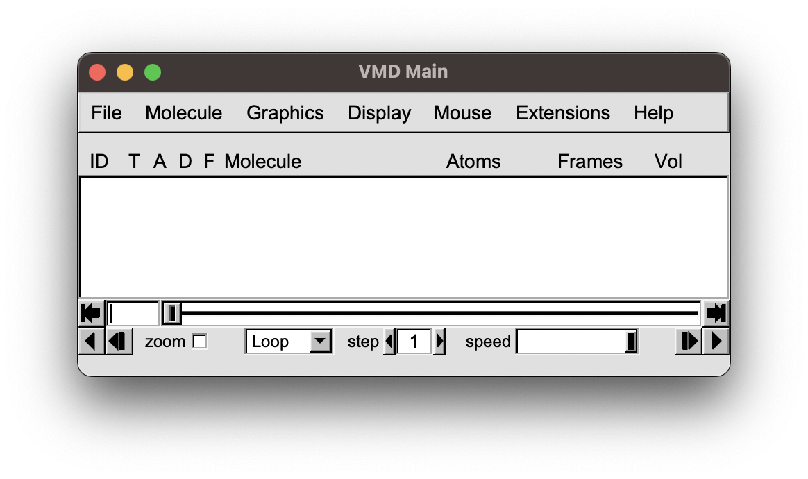
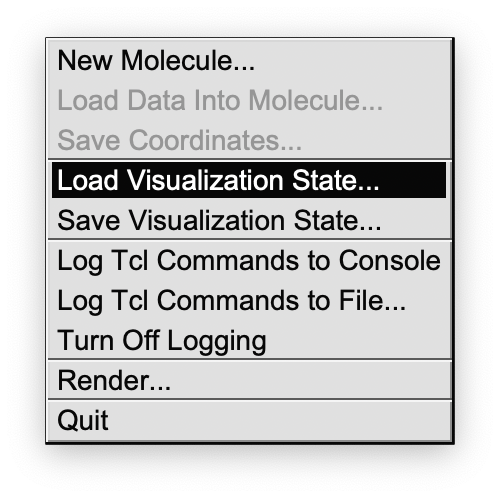
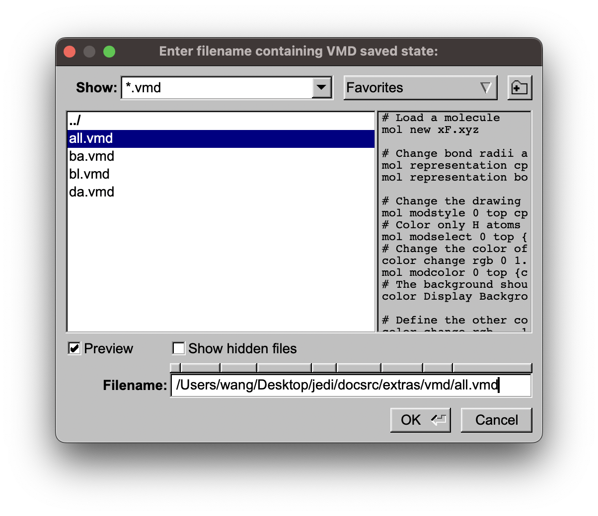
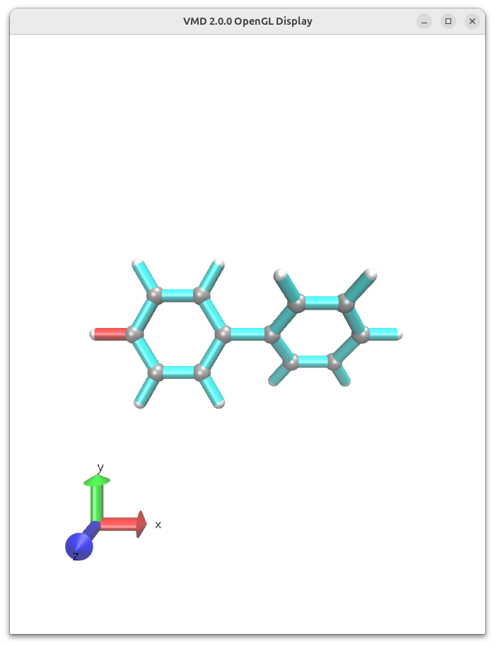
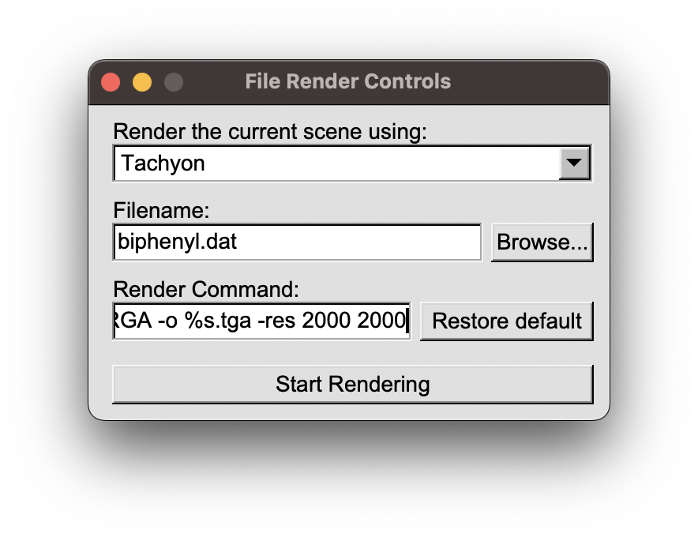

.. _vmd:

=========================
Visual Molecular Dynamics
=========================

For a more beautiful visualisation and the option to render your picture, you can use the Visual Molecular Dynamics (VMD) program together with JEDI.
VMD can be downloaded from the `official website <https://www.ks.uiuc.edu/Development/Download/download.cgi?PackageName=VMD>`_.
To generate the VMD scripts for your JEDI analysis, use the :func:`~strainjedi.visualize` method and set the ``visualizer`` to ``"vmd"``.
It is also possible to use a different color gradient than green to red by using one of the available ``colormap`` options.

.. code-block:: python

   jedi.visualize(visualizer="vmd", colormap="cyan_red", output_dir="vmd")

In the generated folder, you can find the VMD scripts and the color bars for the different modes together with a "xF.xyz" file for the distorted structure.

.. hint::
   Please be aware that the VMD script needs the absolute path to the "xF.xyz" file.
   You can change it in the script when you move the folder to another place.

You can download the vmd folder below, generated by calling ``visualize()`` for a biphenyl example, to follow the tutorial.

:download:`vmd example <../_static/downloads/vmd.zip>`

In VMD you click on:

1. "File" "Load Visualization State"

2. then select the VMD file you like, depending on the kind of redundant internal coordinate.

3. The view can be changed with the mouse by click and drag. If you want to translate the structure press "t" and then click and drag. To rotate, press "r" and then click and drag. Zoom out with "ctrl-z" and in with "ctrl-a". The hot keys can be found here: `VMD Hot Keys <https://www.ks.uiuc.edu/Research/vmd/vmd-1.7.1/ug/node30.html>`_

4. Render your view by clicking on "File" "Render..". We recommend to use "Tachyon". Then determine the filename and add "-res 2000 2000" to the render command for a high resolution.

